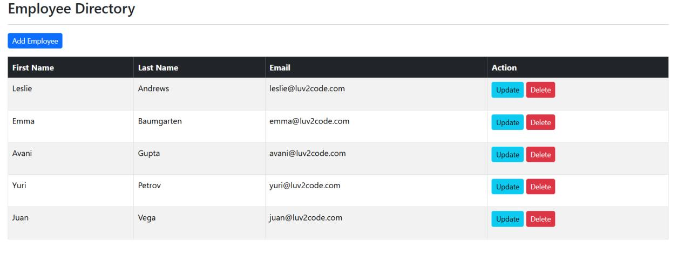

# Spring Boot Application Suite

This repository contains a collection of **Spring Boot mini-projects** combined into a **single full-featured application**. It integrates **REST APIs, authentication, database management, and web-based UI with Thymeleaf**, showcasing various aspects of the **Spring Boot ecosystem**. The goal of this project is to serve as a **comprehensive learning resource** for backend development using **Java and Spring Boot**.

---

## Table of Contents

1. [Introduction](#introduction)
2. [Features](#features)
3. [Technologies Used](#technologies-used)
4. [Getting Started](#getting-started)
5. [Application Modules](#application-modules)
6. [License](#license)
7. [Acknowledgments](#acknowledgments)

---

## Introduction

This project is a **full-featured Spring Boot application** that brings together multiple mini-projects developed while learning **Spring Boot**. It covers core backend development topics, including **building secure REST APIs, user authentication, CRUD operations, database persistence, and web UI integration using Thymeleaf**.

This project was built while following **Chad Darby's Spring Boot course on Udemy**, which provides in-depth knowledge of the **Spring framework** and its real-world applications.

---

## Features

- **User Authentication & Authorization** – Implemented using **Spring Security**.
- **CRUD Operations** – Create, Read, Update, and Delete functionality for managing entities.
- **REST API Implementation** – Secure API endpoints for interaction with the frontend.
- **Thymeleaf-based Web UI** – Server-side rendering using **Spring MVC and Thymeleaf**.
- **Database Integration** – Stores data using **MySQL with JPA and Hibernate**.
- **Pagination & Sorting** – Efficient data handling for large datasets.
- **Modular Architecture** – Separate modules handling different parts of the application.

---

## Technologies Used

- **Java**
- **Spring Boot**
- **Spring Security**
- **Spring Data JPA**
- **Thymeleaf**
- **MySQL**
- **Maven**

---

## Getting Started

### Prerequisites

To run this application, ensure you have:

- **Java 17+**
- **Maven**
- **MySQL Server**
- **An IDE** (e.g., IntelliJ IDEA, Eclipse, or VS Code with Java support)

### Database Setup

This application requires **MySQL** for data storage. The database connection settings can be configured in the **application.properties** file.

---

## Application Modules

This application consists of multiple modules, each focusing on a specific **Spring Boot concept**:

### **1. User Management System**
- **Functionality:** Handles **user registration, login, and authentication**.
- **Key Technologies:** **Spring Security, JWT (if included), MySQL, Spring Data JPA**.
- **Endpoints:** RESTful APIs for managing users, authentication, and roles.

### **2. CRUD API with Database Persistence**
- **Functionality:** Generic CRUD functionality for managing data entities.
- **Key Technologies:** **Spring Boot, Spring Data JPA, MySQL**.
- **Endpoints:** RESTful APIs to create, read, update, and delete database records.

### **3. Web UI with Thymeleaf**
- **Functionality:** A web-based UI for user interaction using **Thymeleaf templates**.
- **Key Technologies:** **Spring MVC, Thymeleaf, HTML/CSS**.
- **Features:** Dynamic pages with form handling, authentication, and validation.

### **4. Advanced Features**
- **Pagination & Sorting** – Implements efficient data handling for large datasets.
- **Role-Based Access Control** – Restricts certain API endpoints based on user roles.
- **Error Handling** – Custom exception handling to ensure smooth API responses.

---

## License

This project is licensed under the **MIT License** - see the [LICENSE](LICENSE) file for details.

---

## Acknowledgments

- **Special thanks to [Char Darby](https://www.udemy.com/course/spring-hibernate-tutorial/?couponCode=KEEPLEARNING)** for his **Spring Boot course on Udemy**, which provided the foundation for this project.
- Thanks to the **Spring Boot and Java communities** for their extensive documentation and best practices.